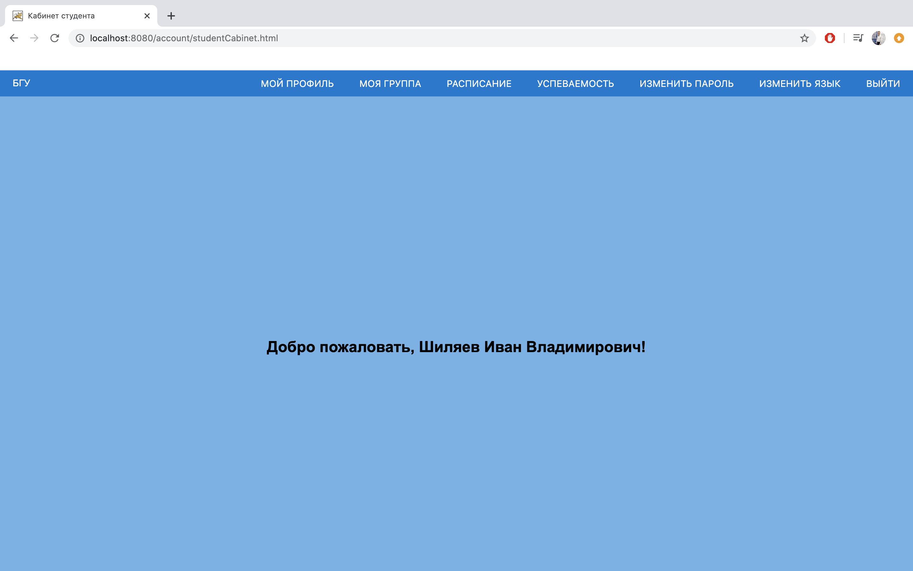
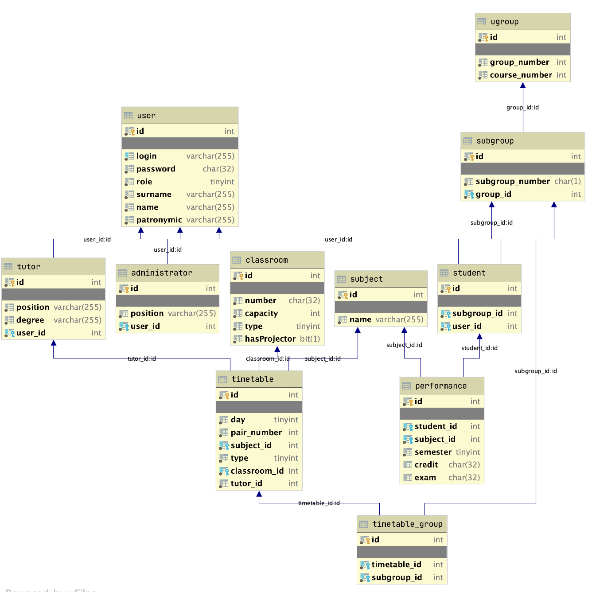

# Java training

🖥 Final web project on Java EPAM course.

-  [Final task](https://github.com/ivanshilyaev/javaTraining/tree/master/finalTask)

## Личный кабинет студента

### Описание

Приложение включает раздел для студента, преподавателя и администратора (работника деканата). Студент может смотреть расписание по дням и успеваемость по семестрам. Преподаватель имеет возможность просматривать список всех предстоящих пар. Администратор имеет доступ к списку всех пользователей, а также возможность добавлять и удалять студентов и преподавателей.

Каждый пользователь должен авторизоваться. Существует возможность смены пароля. Интерфейс приложения локализован. Выбор осуществляется между русским и английским языком. Действия для каждой роли строго ограничены: студент не имеет доступа к функциям администратора и наоборот.

За основу для данного приложения был взят [личный кабинет](https://student.bsu.by/) студента БГУ. По сравнению с ним были добавлены разделы для преподавателя и администратора.

Каждый из разделов планируется значительно расширить в перспективе. Студент сможет видеть информацию о посещаемости, а также иметь раздел с новостями и предстоящими мероприятиями. Преподаватель будет иметь возможность переходить сразу к списку группы и видеть успеваемость каждого студента. Работник деканата сможет добавлять пары в расписание и размещать объявления для студентов и преподавателей.

### Реализация

В данном приложении использовались технологии Servlet и JSP для реализации web-части, а также JDBC для хранения и обработки данных пользователей. Архитектура приложения соответсвует шаблону Layered atchitecture. Кроме того, при разработке были использованы такие шаблоны проектирования как Proxy, DAO, Abstract Factory, Factory Method, Command и другие. Весь ход выполнения приложения, а также все возникающие исключительные ситуации логгируются с помощью Log4J2. Для тестирования был использован фреймворк TestNG. Приложение частично документировано согласно требованиям javadoc.

Ниже представлена схема базы данных разработанного приложения:

Имя пользователя для входа под каждой ролью:

студент - 1823127,
преподаватель - tutor1,
администратор - admin1;

пароль для каждого из пользователей - 11111.

---

by [@ivanshilyaev](https://github.com/ivanshilyaev), 2020
